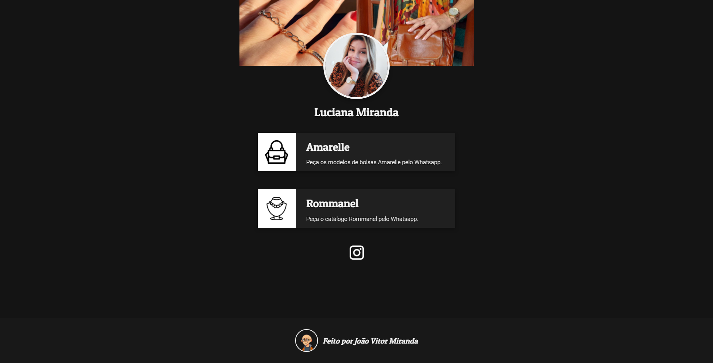
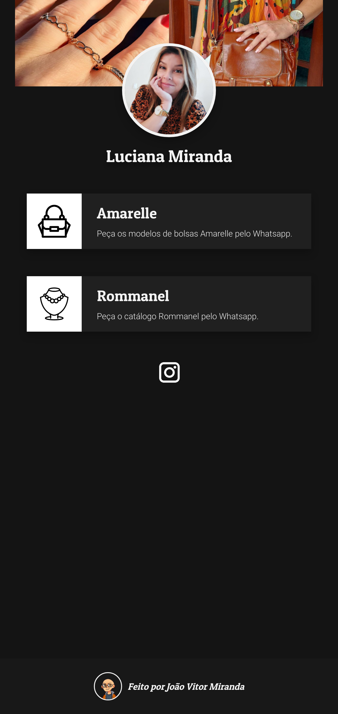

# Social Tree Page (Mobile-First)

This repository contains the project files for a Social Tree Page (A page with contact links for selling usually used on instagram bios).

## This project was done with:

* Figma for design
* Semantic HTML for Structure 
* CSS for Styling
* Flexbox Properties for Layout
* Media Queries for Responsiveness

## Screenshots

## Used by

This project is used by:

- Luciana Miranda (https://www.instagram.com/lu.joiasrommanel/)

## Authors

- [@jv-miranda](https://github.com/jv-miranda)

